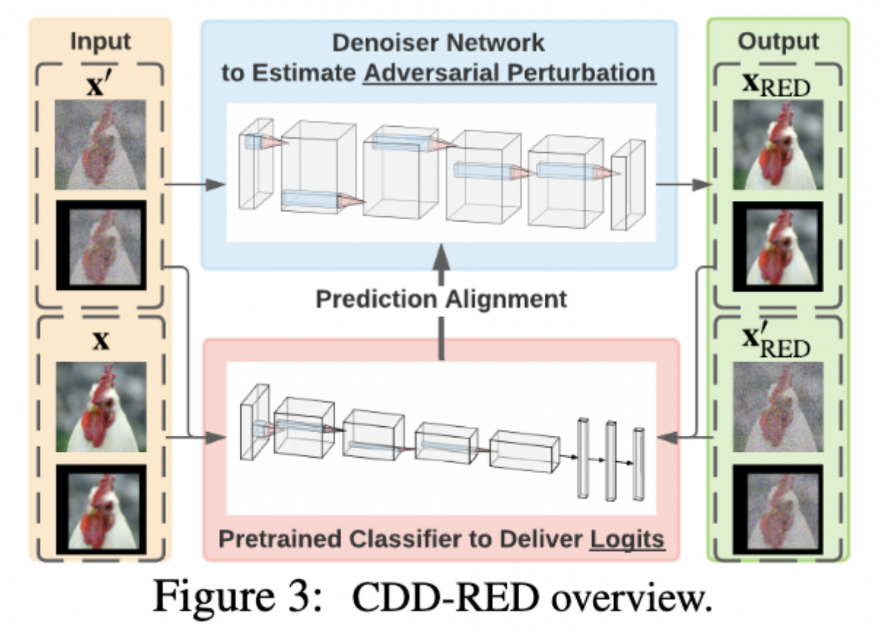

# RED_Denoising
This is the code to run Reverse Engineering of Imperceptible Adversarial Image Perturbations, accepted to ICLR'22. 

Reverse Engineering of Imperceptible Adversarial Image Perturbations
Yifan Gong, Yuguang Yao, Yize Li, Yimeng Zhang, Xiaoming Liu, Xue Lin, Sijia Liu

ICLR'22 
Paper: https://openreview.net/forum?id=gpp7cf0xdfN

There has been a vast volume of research to generate and defend such adversarial attacks. However, the following problem is left unexplored: *How to reverse-engineer adversarial perturbations from an adversarial image?*
This leads to a new adversarial learning paradigm---Reverse Engineering of Deceptions (RED). 
If successful, RED allows us to estimate adversarial perturbations and recover the original images. 
However, carefully crafted, tiny adversarial perturbations are difficult to recover by optimizing a unilateral RED objective. For example, the pure image denoising method may overfit to minimizing the reconstruction error but hardly preserves the classification properties of the true adversarial perturbations. 
To tackle this challenge, we formalize the RED problem and identify a set of principles crucial to the RED approach design. 
Particularly, we find that prediction alignment and proper data augmentation (in terms of spatial transformations) are two criteria to achieve a generalizable  RED approach. 



## Preparation
#### Set up a new anaconda environment with name [environment-name] by using the environment.yml file with the following command:
```
conda [environment-name] create -f environment.yml
```
#### Download and unzip the training and testing dataset.
The training dataset can be downloaded at: https://drive.google.com/u/0/uc?id=1o-qw03zlaV7mmETnVYwCj1zcXiWx18Ql&export=download.

The in-distribution and out-of-distribution testing dataset can be downloaded at: https://drive.google.com/u/1/uc?id=1Q6f4RbhCO23LSAiiMzW0rxqYZKrnHuol&export=download.

The AutoAttack dataset can be downloaded at: https://drive.google.com/u/0/uc?id=1VPLQgFgFQAx9-pZQyyQQgCwB4w546nPd&export=download.

#### Download the Robust Res50 checkpoint at: https://drive.google.com/drive/folders/1W2zGHyxTPgHhWln1kpHK5h-HY9kwfKfl.

#### You can download trained denoiser checkpoints including DO, DS, CDD-RED at: https://drive.google.com/file/d/1PKMkcgZ1OKgZR-kI4S_bEYH4r2KWkupR/view?usp=sharing.


## Run the code
### Train the denoiser with the following command:
```
bash RED_denoiser_train_with_trans.sh
```
#### The following configurations in RED_denoiser_train.sh have to be changed to run the .sh file successfully:
1. Set 'root' to the path of the code directory;
2. Set 'advdata_dir' to the path of the training dataset folder;
3. Set 'robust_res50_path' to the path of the downloaded Robust Res50 model;
4. You can modify other hyperparameter settings such as 'lambda' and 'lr' according to your requirement.


### Test the denoiser in terms of pixel-level reconstruction error, prediction-level alignment, and angles with the following command:
```
bash test_shift.sh
```
#### The following configurations in test_shift.sh have to be changed to run the .sh file successfully
1. Set 'denoiser' to the path of the trained denoiser;
2. Set 'img_folder' to the path of the in-distribution and out-of-distribution testing dataset folder;
3. Set 'autoattack_dir' to the path of the AutoAttack on Resnet50 dataset folder;
4. Set 'robustauto_dir' to the path of the AutoAttack on Robust Resnet50 dataset folder;
5. Set 'robust_res50_path' to the path of the downloaded Robust Res50 model;
6. Change 'intensity' to 'weak'/'medium'/'strong'/'out'/'auto'/'robust-auto' to test the denoise performance on different testin data.

### Test the denoiser with partially-perturbed data under different interpolation portions with the following command:
```
bash test_portion.sh
```
#### The following configurations in test_portion.sh have to be changed to run the .sh file successfully
1. Set 'denoiser' to the path of the trained denoiser;
2. Set 'img_folder' to the path of the in-distribution and out-of-distribution testing dataset folder;
2. You can modify other hyperparameter settings according to your requirements.


## Citation
@inproceedings{

gong2022reverse,

title={Reverse Engineering of Imperceptible Adversarial Image Perturbations},

author={Yifan Gong and Yuguang Yao and Yize Li and Yimeng Zhang and Xiaoming Liu and Xue Lin and Sijia Liu},

booktitle={International Conference on Learning Representations},

year={2022},

url={ https://openreview.net/forum?id=gpp7cf0xdfN }

}


